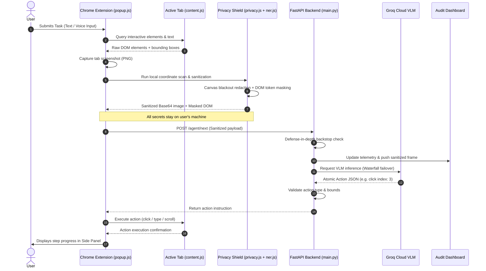

# 🛡️ S.H.I.E.L.D — Privacy-Preserving AI Browser Vision Agent

[](https://python.org)
[](https://fastapi.tiangolo.com)
[](https://developer.chrome.com/docs/extensions/reference/sidePanel/)
[](https://groq.com)
[](https://github.com)
[](LICENSE)

> **Autonomous Vision-driven Web Navigation with Zero-Leakage Client-Side Privacy Guarantees.**  
> S.H.I.E.L.D (*Secure Heuristic & In-browser Entity Level Defense*) enables autonomous AI browser agents to automate complex web tasks, fill forms, and interact with dynamic web applications without ever sending raw passwords, payment cards, national identity documents (Aadhaar, PAN, Passport), API keys, or personal credentials to third-party cloud Vision-Language Models (VLMs).

---

## 📑 Table of Contents

1. [Executive Summary](#-executive-summary)
2. [The VLM Privacy Dilemma](#-the-vlm-privacy-dilemma)
3. [Technology Stack](#-technology-stack)
4. [System Architecture](#-system-architecture)
   - [High-Level Architectural Diagram](#high-level-architectural-diagram)
   - [Architectural Layers & Responsibilities](#architectural-layers--responsibilities)
   - [Security & Trust Boundary](#security--trust-boundary)
5. [End-to-End Operational Workflow](#-end-to-end-operational-workflow)
   - [Step-by-Step Execution Sequence](#step-by-step-execution-sequence)
   - [Mermaid Sequence Flow](#mermaid-sequence-flow)
6. [Core Features & Innovations](#-core-features--innovations)
7. [Comprehensive Privacy & Redaction Matrix](#-comprehensive-privacy--redaction-matrix)
8. [Repository Directory Structure](#-repository-directory-structure)
9. [Prerequisites & System Requirements](#-prerequisites--system-requirements)
10. [Installation & Quickstart Guide](#-installation--quickstart-guide)
    - [Step 1: Backend Setup](#step-1-backend-setup)
    - [Step 2: Extension Setup](#step-2-extension-setup)
    - [Step 3: Verification with KYC Testbed](#step-3-verification-with-kyc-testbed)
11. [Live Compliance Audit Dashboard](#-live-compliance-audit-dashboard)
12. [Native Voice Input (Speech-to-Text)](#-native-voice-input-speech-to-text)
13. [API Reference & Protocols](#-api-reference--protocols)
14. [Testing & Quality Assurance](#-testing--quality-assurance)
15. [Threat Model & Security Analysis](#-threat-model--security-analysis)
16. [License & Acknowledgments](#-license--acknowledgments)

---

## 💡 Executive Summary

Modern AI browser agents bridge LLMs with real-world web environments by reading visual screenshots and DOM structures. However, this creates a critical security risk: **any sensitive information visible on screen is sent directly to third-party cloud APIs**.

**S.H.I.E.L.D** solves this by enforcing a **strict client-side privacy boundary** directly inside the browser runtime. Before any data is transmitted to the AI decision engine:
- Sensitive text and input elements are masked in the DOM.
- Visual coordinates are calculated and physically blacked out on the screenshot using an HTML5 Canvas.
- Unstructured entities (names, locations) are extracted on-device via local NLP.
- Only **sanitized visual layouts and masked DOM trees** leave the user's machine.

---

## 🚨 The VLM Privacy Dilemma

Autonomous multimodal browser agents operate by taking viewport screenshots and serializing DOM trees to cloud-hosted Vision-Language Models (e.g., GPT-4o, Claude 3.5 Sonnet, Llama 3.2 Vision).

```
❌ TRADITIONAL VLM AGENTS (CRITICAL DATA LEAKAGE):
┌────────────────┐      RAW SCREENSHOT + UNMASKED DOM      ┌──────────────────────────┐
│  Chrome Browser │ ──────────────────────────────────────► │ Third-Party Cloud VLM    │
│  (Passwords,   │     (Includes: Passwords, Aadhaar, PAN,  │ (Exposes secrets to logs,│
│   Cards, PII)  │      Bank Accounts, Session Tokens)      │  prompts & training sets)│
└────────────────┘                                         └──────────────────────────┘

✅ S.H.I.E.L.D AGENT (ZERO-LEAKAGE LOCAL PERIMETER):
┌────────────────┐   LOCAL CANVAS & DOM SANITIZATION       ┌──────────────────────────┐
│  Chrome Browser │ ──► [Blackout Redaction + Masking] ──► │ Cloud VLM Engine         │
│  (Client Side) │     (Zero Raw Credentials Transmitted)  │ (Receives ONLY Safe Data)│
└────────────────┘                                         └──────────────────────────┘
```

When automating banking workflows, KYC verification, healthcare systems, or enterprise internal tools, traditional agents leak:
- 🔑 **Authentication Secrets**: Passwords, PINs, OTPs, session tokens, API keys, AWS credentials.
- 💳 **Financial PII**: Debit/Credit card numbers, CVVs, expiration dates, bank accounts, IFSC codes.
- 🆔 **National Identity Numbers**: Indian Aadhaar cards, PAN cards, Passports, SSNs.
- 👤 **Personal Contact Information**: Legal names, personal email addresses, phone numbers, residential addresses.

Under **GDPR, CCPA, HIPAA, and DPDP** regulations, transmitting unredacted credentials to remote AI APIs constitutes an unacceptable compliance violation.

---

## 🛠️ Technology Stack

| Layer | Component | Technologies & Libraries | Purpose |
| :--- | :--- | :--- | :--- |
| **Client / Browser** | Extension Core | **Chrome Extensions Manifest V3** | Persistent Side Panel runtime, background worker, tab permissions |
| | Visual Redactor | **HTML5 Canvas 2D API** | Pixel-level bounding-box blackout and labeled security overlays |
| | On-Device NLP | **JavaScript / WebAssembly / WebGPU** | Local Named Entity Recognition (`ner.js`) with zero network calls |
| | Speech Engine | **Web Speech API (`webkitSpeechRecognition`)** | Real-time browser-native voice transcription with audio pulse feedback |
| | UI & Styling | **Vanilla CSS3 (Design Tokens)** | VS Code / Copilot inspired Side Panel UI with dark/light themes |
| **Backend Service** | API Framework | **FastAPI (Python 3.10+)** | High-performance asynchronous REST API serving agent endpoints |
| | Server Engine | **Uvicorn (ASGI)** | Production-ready HTTP/1.1 and WebSocket server |
| | Data Validation | **Pydantic v2** | Strict schema validation for page context, elements, and action JSON |
| | Environment | **python-dotenv** | Secure configuration management |
| **AI Decision Engine** | Multimodal LLMs | **Groq Cloud LPU** | Ultra-low-latency VLM inference (~150ms step turnaround) |
| | Model Candidates | `groq/compound-mini`, `openai/gpt-oss-20b`, `openai/gpt-oss-120b`, `qwen/qwen3.6-27b` | Automatic waterfall failover across reasoning and vision models |
| **Audit & Telemetry** | Dashboard UI | **HTML5 / CSS3 / Vanilla JS** | Integrated live telemetry dashboard with VLM frame inspector and PII sandbox |
| **Testing & QA** | Test Runners | **Node.js, Python unittest, requests, httpx** | Automated unit and integration suites for client and server |

---

## 🏛️ System Architecture

### High-Level Architectural Diagram

```
┌────────────────────────────────────────────────────────────────────────────────────────┐
│                              CLIENT RUNTIME (CHROME BROWSER)                           │
│                                                                                        │
│  ┌─────────────────────────────────┐         ┌──────────────────────────────────────┐  │
│  │   Active Browser Tab (Page)     │         │   S.H.I.E.L.D Side Panel (UI)        │  │
│  │   • Full DOM Tree               │         │   • Chat Stream & Step Indicator     │  │
│  │   • Visible Screen Pixels       │         │   • Model Selector & Privacy Drawer  │  │
│  │   • Content Script (content.js) │         │   • Native Voice Input (Web Speech)  │  │
│  └────────────────┬────────────────┘         └──────────────────┬───────────────────┘  │
│                   │                                             │                      │
│                   ▼                                             │                      │
│  ┌───────────────────────────────────────────────────────────┐  │                      │
│  │   Client-Side Privacy Shield (privacy.js & ner.js)         │◄─┘                      │
│  │   1. Element & Attribute Sensitivity Scanner              │                         │
│  │   2. On-Device Named Entity Recognition (PER, LOC, ORG)   │                         │
│  │   3. Regex Pattern Matcher (Aadhaar, PAN, Cards, Secrets) │                         │
│  │   4. Canvas Visual Redactor: Paints blackout bounding boxes│                         │
│  │   5. DOM Sanitizer: Masks text & input values with tokens  │                         │
│  └────────────────────────────┬──────────────────────────────┘                         │
└───────────────────────────────┼────────────────────────────────────────────────────────┘
                                │
                                │ Sanitized Payload:
                                │ • Blacked-Out Base64 Screenshot
                                │ • Token-Masked DOM Context
                                │ (ZERO Raw Credentials Leave the Machine)
                                ▼
┌────────────────────────────────────────────────────────────────────────────────────────┐
│                           FASTAPI BACKEND SERVICE (PORT 8000)                          │
│                                                                                        │
│  ┌──────────────────────────────────────────────────────────────────────────────────┐  │
│  │ Defense-in-Depth Backstop (privacy/policy.py & detector.py)                      │  │
│  │ Halts execution immediately (BLOCKED) if unmasked credentials reach the server    │  │
│  └────────────────────────────────────┬─────────────────────────────────────────────┘  │
│                                       │ Verified Safe                                  │
│                                       ▼                                                │
│  ┌──────────────────────────────────────────────────────────────────────────────────┐  │
│  │ Groq Multimodal Reasoning Engine (main.py)                                       │  │
│  │ Waterfall failover: Compound Mini ➔ GPT-OSS 20B ➔ GPT-OSS 120B ➔ Qwen 27B Vision │  │
│  └────────────────────────────────────┬─────────────────────────────────────────────┘  │
│                                       │ Atomic Action JSON                             │
│                                       ▼                                                │
│  ┌──────────────────────────────────────────────────────────────────────────────────┐  │
│  │ Action Validator & Bounds Checker                                                │  │
│  │ Ensures action type and element indices are strictly within page context bounds  │  │
│  └────────────────────────────────────┬─────────────────────────────────────────────┘  │
│                                       │                                                │
│       ┌───────────────────────────────┴───────────────────────────────┐                │
│       ▼                                                               ▼                │
│  ┌─────────────────────────────┐                         ┌──────────────────────────┐  │
│  │ Action Instruction Callback │                         │ Live Telemetry Store     │  │
│  │ Returns action to extension │                         │ Serves /dashboard & APIs │  │
│  └─────────────────────────────┘                         └──────────────────────────┘  │
└────────────────────────────────────────────────────────────────────────────────────────┘
```

### Architectural Layers & Responsibilities

1. **Extension Presentation Layer (`popup.html`, `popup.css`, `popup.js`)**:
   - Manages the user interaction session within the Chrome Side Panel.
   - Provides text and voice prompt composition, live status chips, model selection, and privacy policy toggles.
2. **In-Page Extraction & Execution Layer (`content.js`)**:
   - Discovers interactive DOM nodes (`button`, `input`, `select`, `a`, `contenteditable`).
   - Calculates bounding boxes (`x`, `y`, `width`, `height`).
   - Executes decided actions (`click`, `type`, `press`, `scroll`) using framework-compatible prototype event dispatching (React, Vue, Angular compatible).
3. **Local Privacy Shield Layer (`privacy.js`, `ner.js`)**:
   - **Canvas Redaction**: Renders tab screenshots onto an off-screen HTML5 canvas, applying solid `#0f172a` blackout fills with `#ef4444` borders and labels over sensitive areas.
   - **DOM Sanitization**: Masks input values, attributes, and visible text with replacement tokens (`[REDACTED_AADHAAR]`, `[REDACTED_CARD]`).
   - **On-Device NER**: Evaluates unstructured text to detect person names, locations, and organizations without external API calls.
4. **Backend AI Orchestration Layer (`main.py`)**:
   - Multi-model decision engine with automatic waterfall failover.
   - Constructs structured system prompts enforcing atomic action JSON output.
   - Implements secondary server-side defense-in-depth verification.
5. **Compliance & Audit Layer (`dashboard.py`)**:
   - Real-time audit dashboard monitoring live VLM frames, redaction counters, step logs, and providing an interactive PII sandbox for auditors.

### Security & Trust Boundary

```
[ UNTRUSTED WEB CONTENT ] ──► [ CHROME CONTENT SCRIPT ]
                                         │
═════════════════════════════════════════╪══════════════════════════════════════════
🔒 LOCAL CLIENT PRIVACY PERIMETER       ▼
                              [ PRIVACY SHIELD ]
                              • Canvas Blackout
                              • DOM Sanitization
                              • Local NER
═════════════════════════════════════════╪══════════════════════════════════════════
                                         │ Sanitized Data ONLY
                                         ▼
                             [ REST API (FastAPI) ]
                                         │
                                         ▼
                              [ CLOUD VLM (Groq) ]
```

---

## 🔄 End-to-End Operational Workflow

### Step-by-Step Execution Sequence

```
1. USER PROMPT
   User enters command via keyboard or voice (e.g. "Review KYC and submit")
       │
       ▼
2. VIEWPORT CAPTURE & DOM DISCOVERY
   • chrome.tabs.captureVisibleTab captures the visual screen as Base64 PNG.
   • content.js traverses interactive elements, computes bounding boxes and visible text.
       │
       ▼
3. LOCAL ON-DEVICE SANITIZATION
   • privacy.js identifies structured PII (Aadhaar, PAN, Cards, Secrets, Contacts).
   • ner.js classifies unstructured entities (Names, Locations, Orgs) locally.
   • Off-screen HTML5 Canvas draws solid blackout boxes over sensitive pixel coordinates.
   • Page context text and DOM element values are replaced with token placeholders.
       │
       ▼
4. SECURE DISPATCH
   • Sanitized Base64 screenshot + masked DOM context sent to POST /agent/next.
   • Zero raw credentials or PII ever leave the local browser.
       │
       ▼
5. DEFENSE-IN-DEPTH & AI REASONING
   • FastAPI server performs secondary regex backstop check.
   • Groq VLM receives sanitized visual frame + masked DOM element list.
   • AI selects optimal atomic action (e.g. {"action": "click", "index": 2}).
       │
       ▼
6. ACTION EXECUTION & AUDIT LOGGING
   • Action JSON is bounds-checked and validated by backend.
   • content.js executes action in the active browser tab.
   • Telemetry state updates live dashboard frame and metrics at /dashboard.
       │
       ▼
7. TERMINATION
   • Loop repeats until AI returns {"action": "done", "result": "..."} or max steps reached.
```

### Mermaid Sequence Flow



---

## ⚡ Core Features & Innovations

- **🔒 Client-Side Zero-Leakage Guarantee**: 100% of PII detection, canvas pixel redaction, and DOM attribute masking occur locally in Chrome before network serialization.
- **🎨 HTML5 Canvas Blackout Engine**: High-fidelity visual bounding-box redaction that obscures sensitive visual regions while preserving spatial layout awareness for the VLM.
- **🧠 On-Device Named Entity Recognition (`ner.js`)**: Real-time browser NLP identifying Person Names (`PER`), Locations (`LOC`), and Organizations (`ORG`) with zero external network requests.
- **🇮🇳 Comprehensive Indian & International PII Coverage**:
  - **Aadhaar Numbers**: `\d{4}[\s-]\d{4}[\s-]\d{4}`
  - **PAN Cards**: `[A-Z]{5}[0-9]{4}[A-Z]`
  - **Passports & Bank Details**: Bank Account Numbers, IFSC Codes (`[A-Z]{4}0[A-Z0-9]{6}`), Credit/Debit Cards, CVVs
  - **Authentication Secrets**: Passwords, PINs, OTPs, API keys (`sk-...`), AWS access keys (`AKIA...`), JWT tokens (`eyJ...`)
  - **Contacts**: RFC-compliant email addresses, Mobile phone numbers (`+91` Indian mobile formats)
- **🎙️ Native Voice Input (Speech-to-Text)**: Speak browser commands hands-free via Chrome's native Web Speech API (`webkitSpeechRecognition`) with real-time text streaming and pulsing audio wave feedback.
- **⚙️ Dynamic User Privacy Preferences**: Slide-out configuration drawer in the extension to toggle individual privacy categories and define custom confidential words on the fly.
- **🤖 Resilient Multi-Model Groq Engine**: Automatic waterfall failover across high-speed models:
  - `groq/compound-mini` (Ultra-fast default)
  - `openai/gpt-oss-20b` (Deep step-by-step reasoning)
  - `openai/gpt-oss-120b` (Complex enterprise workflows)
  - `qwen/qwen3.6-27b` (High-precision multimodal vision)
- **🖥️ Native Manifest V3 Chrome Side Panel**: Persistent Copilot-style side panel UI featuring dynamic dark/light themes, model picker drop-up, and in-app modal confirmations.
- **📊 Real-Time Compliance Audit Dashboard**: Live enterprise dashboard at `http://127.0.0.1:8000/dashboard` featuring a VLM frame inspector, redaction category histograms, timeline logs, and an interactive PII sandbox.

---

## 📊 Comprehensive Privacy & Redaction Matrix

| Category | Targeted Data & Regex Patterns | Client Detection Mechanism | Visual Canvas Appearance | Cloud AI Model Visibility |
| :--- | :--- | :--- | :--- | :--- |
| **Authentication** | Passwords, PINs, OTPs, Security Codes, Auth Tokens | Input `type="password"`, field name heuristics, regex | Blackout rectangle + `🔒 [REDACTED_PASSWORD]` | Completely Obscured |
| **National IDs (India)** | Aadhaar (`\d{4}[\s-]\d{4}[\s-]\d{4}`), PAN (`[A-Z]{5}\d{4}[A-Z]`) | Strict non-overlapping regex + attribute matching | Blackout rectangle + `🔒 [REDACTED_AADHAAR]` | Completely Obscured |
| **Financial PII** | Credit/Debit Cards (`(?:\d{4}[\s-]?){3}\d{4}`), CVV, Bank A/C, IFSC | Pattern matching + form label keywords | Blackout rectangle + `🔒 [REDACTED_CARD]` | Completely Obscured |
| **Cloud Secrets & Keys** | API Keys (`sk-`, `pk-`), AWS Keys (`AKIA...`), JWTs (`eyJ...`) | Key prefix regex + token delimiter matching | Blackout rectangle + `🔒 [REDACTED_API_KEY]` | Completely Obscured |
| **Contact Information** | Personal Emails, Mobile Phone Numbers (`(?:\+91)?[6-9]\d{9}`) | RFC email regex + international dial patterns | Blackout rectangle + `🔒 [REDACTED_EMAIL]` | Completely Obscured |
| **Unstructured Entities** | Full Person Names, Cities, Hospitals, Banks | On-device token context + honorific gazetteer | Blackout rectangle + `🔒 [REDACTED_PERSON]` | Completely Obscured |
| **Custom Confidential** | Proprietary codenames, project titles, employee IDs | Dynamic user-configured keyword scanner | Blackout rectangle + `🔒 [REDACTED_SECRET]` | Completely Obscured |

---

## 📂 Repository Directory Structure

```
privacy-browser-agent/
├── README.md                      # Comprehensive project documentation
├── logo.png                       # Official S.H.I.E.L.D emblem logo
├── demo_secure_form.html          # Interactive KYC Citizen Banking verification testbed
│
├── backend/                       # FastAPI AI Decision Engine & Telemetry Service
│   ├── .env                       # Environment credentials (GROQ_API_KEY, AGENT_MODEL)
│   ├── .gitignore                 # Git ignore configuration
│   ├── requirements.txt           # Python package dependencies
│   ├── main.py                    # FastAPI server, agent loop, API endpoints
│   ├── dashboard.py               # Live compliance audit dashboard HTML/CSS/JS
│   ├── agent.py                   # Standalone browser-use reference implementation
│   ├── test_api_flow.py           # Integration test for backend API & Groq inference
│   ├── test_client_privacy.js     # Automated Node.js unit test suite for Privacy Shield
│   ├── test_privacy.py            # Unit tests for backend detector patterns
│   ├── test_policy.py             # Unit tests for policy decision rules
│   ├── test_redactor.py           # Unit tests for backend string redaction
│   └── privacy/                   # Server-side defense-in-depth privacy package
│       ├── __init__.py            # Package export definitions
│       ├── detector.py            # Backend pattern detection & element parser
│       ├── policy.py              # Policy engine (ALLOW, REDACT, BLOCK)
│       └── redactor.py            # Position-preserving string redactor
│
└── extension/                     # Chrome Manifest V3 Side Panel Extension
    ├── manifest.json              # Extension manifest (MV3, SidePanel, Scripting)
    ├── background.js              # Service worker managing side panel behavior
    ├── content.js                 # In-page DOM extractor & synthetic action executor
    ├── ner.js                     # On-device client Named Entity Recognition engine
    ├── privacy.js                 # HTML5 Canvas pixel redactor & DOM sanitizer
    ├── popup.html                 # Extension Side Panel interface & markup
    ├── popup.css                  # Side Panel styling (VS Code theme, dark/light modes)
    ├── popup.js                   # Client agent loop, Web Speech API, state manager
    └── logo.png                   # Extension icon asset
```

---

## 💻 Prerequisites & System Requirements

Before running the project, verify that your environment meets the following requirements:

- **Operating System**: Windows 10/11, macOS (Intel/Apple Silicon), or Linux
- **Python**: Version `3.10` or higher
- **Google Chrome**: Version `116` or higher (required for Chrome Side Panel API support)
- **Groq Cloud API Key**: Obtain a free API key at [console.groq.com](https://console.groq.com)
- **Node.js** *(optional)*: Version `18+` for executing client-side privacy unit tests

---

## 🚀 Installation & Quickstart Guide

### Step 1: Backend Setup

Navigate to the `backend/` directory:

```bash
cd backend
```

Create and activate a Python virtual environment:

```bash
# On Windows (PowerShell)
python -m venv .venv
.\.venv\Scripts\activate

# On macOS / Linux
python3 -m venv .venv
source .venv/bin/activate
```

Install backend dependencies:

```bash
pip install -r requirements.txt
```

Configure environment variables in `backend/.env`:

```env
GROQ_API_KEY=gsk_your_groq_api_key_here
AGENT_MODEL=groq/compound-mini
```

Start the FastAPI application with Uvicorn:

```bash
uvicorn main:app --reload --host 127.0.0.1 --port 8000
```

Verify backend health:
- **API Health Check**: [http://127.0.0.1:8000/](http://127.0.0.1:8000/)
- **Live Audit Dashboard**: [http://127.0.0.1:8000/dashboard](http://127.0.0.1:8000/dashboard)

---

### Step 2: Extension Setup

1. Open Google Chrome and navigate to `chrome://extensions/`.
2. Enable **Developer mode** using the toggle in the top-right corner.
3. Click **Load unpacked** in the top-left menu.
4. Select the `extension/` directory from this repository:  
   `privacy-browser-agent/extension`
5. The **S.H.I.E.L.D** icon will appear in your Chrome extensions bar.
6. Click the extension icon. S.H.I.E.L.D will open permanently pinned in the **Chrome Side Panel**.

---

### Step 3: Verification with KYC Testbed

An interactive test page is included in the project root: `demo_secure_form.html`.

1. Open `demo_secure_form.html` in Chrome:
   - Drag and drop `demo_secure_form.html` into a Chrome tab, or navigate to `file:///path/to/demo_secure_form.html`.
2. The page simulates a **Citizen Banking & KYC Verification Portal** containing:
   - Public fields: Full Name, City of Residence
   - Protected identity records: Aadhaar Number (`1234 5678 9012`), PAN Card (`ABCDE1234F`)
   - Protected contacts: Personal Email (`pranesh.kumar@example.com`), Mobile Phone (`+91 9876543210`)
   - Protected financial data: Credit Card (`4111 2222 3333 4444`), Security PIN (`9876`)
   - Unstructured text: Person Names, Locations, and Organizations
3. Open the **S.H.I.E.L.D Side Panel**.
4. In the composer textarea, enter your command or use voice input:
   ```text
   Verify the details on this KYC portal and click the Complete Verification & Submit button.
   ```
5. Click **Send** (or press `Enter`).
6. Observe the privacy pipeline in real-time:
   - The browser scans all sensitive coordinates on-device.
   - The Canvas paints blackout rectangles with labels over all sensitive inputs.
   - The sanitized Base64 screenshot and masked DOM are sent to Groq.
   - The AI identifies the target submit button by index and executes the click.
7. Open [http://127.0.0.1:8000/dashboard](http://127.0.0.1:8000/dashboard) to view the live sanitized screenshot frame and audit metrics.

---

## 📈 Live Compliance Audit Dashboard

The backend includes a built-in enterprise compliance dashboard at `http://127.0.0.1:8000/dashboard`:

- 🖼️ **VLM Frame Inspector**: Inspect the exact visual screenshot received by the Vision AI, confirming that sensitive fields are completely blacked out with protective labels.
- 📊 **PII Redaction Breakdown**: Live counters and category histograms tracking redactions for Aadhaar, PAN, Card, CVV, Password, PIN, OTP, Phone, Email, API Key, and JWT.
- ⏱️ **Timeline Audit Log**: Step-by-step audit record of user requests, active model, generated actions, and timestamps.
- 🧪 **Interactive PII Sandbox**: Testbed for auditors to input arbitrary text or strings and observe on-the-fly detection and sanitization output.
- 🌓 **Theme Support**: Seamless dark and light themes matching enterprise design standards.

---

## 🎙️ Native Voice Input (Speech-to-Text)

S.H.I.E.L.D features hands-free voice commanding directly inside the Chrome Side Panel:

1. Click the **Microphone** icon next to the Send button.
2. If prompted, grant microphone access in Chrome.
3. The mic button displays a pulsing red audio beacon (`@keyframes micPulseWave`) and the input placeholder shifts to `"Listening... Speak now"`.
4. Speak your instructions naturally. The text streams into the prompt composer in real-time.
5. Click the microphone again (or press Enter) to finish and send the command.

---

## 📡 API Reference & Protocols

### `GET /`
Returns service health, active AI model, and dashboard link.

**Response:**
```json
{
  "status": "ok",
  "service": "S.H.I.E.L.D Vision Browser Agent API",
  "privacy_shield": "Client-Side Zero-Leakage Active",
  "model": "groq/compound-mini",
  "dashboard_url": "http://127.0.0.1:8000/dashboard"
}
```

---

### `POST /agent/next`
Evaluates the current sanitized browser state and determines the next single atomic browser action.

**Request Body:**
```json
{
  "task": "Submit the registration form",
  "page_context": {
    "url": "https://example.com/register",
    "title": "User Registration",
    "text": "Name: John Doe. Email: [REDACTED_EMAIL].",
    "elements": [
      {
        "tag": "button",
        "type": "submit",
        "text": "Register",
        "rect": { "x": 100, "y": 240, "width": 150, "height": 40 }
      }
    ]
  },
  "screenshot": "data:image/jpeg;base64,...",
  "history": [],
  "privacy": {
    "redactedCount": 2,
    "categories": { "PASSWORD": 1, "EMAIL": 1 },
    "status": "CLIENT_PROTECTED"
  },
  "model": "groq/compound-mini"
}
```

**Response:**
```json
{
  "success": true,
  "action": {
    "action": "click",
    "index": 0
  },
  "model_used": "groq/compound-mini",
  "privacy": {
    "redactedCount": 2,
    "categories": { "PASSWORD": 1, "EMAIL": 1 },
    "status": "CLIENT_PROTECTED"
  }
}
```

---

### Supported Action Types

| Action | Format | Description |
| :--- | :--- | :--- |
| `navigate` | `{"action": "navigate", "url": "https://example.com"}` | Navigates the active tab to the specified URL |
| `click` | `{"action": "click", "index": 3}` | Clicks element at specified index from interactive list |
| `type` | `{"action": "type", "index": 1, "text": "value"}` | Focuses element, sets value, and dispatches input events |
| `press` | `{"action": "press", "key": "ENTER"}` | Dispatches keyboard keydown and keyup events |
| `scroll` | `{"action": "scroll", "direction": "down"}` | Scrolls viewport smoothly (`up` or `down`) |
| `done` | `{"action": "done", "result": "Task completed"}` | Concludes task execution and reports final result |

---

### `GET /api/telemetry`
Returns accumulated real-time telemetry, step counts, category histograms, and the latest sanitized frame.

### `POST /api/telemetry/reset`
Resets the in-memory telemetry buffer.

### `POST /api/sandbox/test`
Instant PII detection and redaction sandbox endpoint.
```json
{
  "text": "Contact pranesh@example.com or call +91 9876543210 with PAN ABCDE1234F"
}
```

---

## 🧪 Testing & Quality Assurance

S.H.I.E.L.D includes automated test suites covering both the client-side privacy engine and backend decision pipeline.

### 1. Client-Side Privacy Shield & NER Test (Node.js)
Tests on-device regex masking, token intervals, custom secret matching, and DOM sanitization:

```bash
cd backend
node test_client_privacy.js
```

**Output:**
```
=======================================================
   TESTING CLIENT-SIDE PRIVACY SHIELD & ON-DEVICE NER 
=======================================================
Test [1] Indian Aadhaar Masking: PASSED ✅
Test [2] Indian PAN Card Masking: PASSED ✅
Test [3] Credit Card Masking: PASSED ✅
Test [4] Email and Phone Masking: PASSED ✅
Test [5] API Key and JWT Token Masking: PASSED ✅
Test [6] Bank Account and IFSC Masking: PASSED ✅
Test [7] Unstructured Person Name & Location (On-Device NER): PASSED ✅
Test [8] User-Defined Custom Confidential Words: PASSED ✅
Page Sanitization: PASSED ✅
=======================================================
   TOTAL TESTS: 9 | PASSED: 9
=======================================================
```

### 2. Backend Integration Test (Python)
Validates `/` health check, sanitized payload handling, and model inference:

```bash
cd backend
python test_api_flow.py
```

### 3. Backend Privacy Detection & Policy Tests
Validates server-side regex detection, policy actions, and text redactor:

```bash
cd backend
python test_privacy.py
python test_policy.py
python test_redactor.py
```

---

## 🔒 Threat Model & Security Analysis

| Threat Vector | Potential Impact | S.H.I.E.L.D Mitigation |
| :--- | :--- | :--- |
| **Direct Screen Leakage** | Cloud VLM reads credentials from raw pixels | In-browser Canvas blackouts all sensitive coordinates with opaque `#0f172a` boxes before export. |
| **DOM Inspection Leakage** | Cloud VLM reads credentials from HTML tree | All sensitive DOM text, values, names, and placeholders are sanitized to `[REDACTED_*]` tokens before sending. |
| **Unstructured PII in Text** | Names and addresses leaked in free-form text | Client-side NER engine scans and masks Person Names, Locations, and Organizations locally on-device. |
| **Prompt Injection Attacks** | Malicious web page attempts to instruct agent to read credentials | The agent system prompt explicitly marks redacted regions as non-extractable, and credentials are removed from the context entirely. |
| **Client Redaction Bypass** | Corrupted client script fails to mask secret | Backend `server_privacy_check` acts as a fail-safe backstop, immediately returning `BLOCKED` status if unmasked credentials reach the server. |

---

## ⚖️ License & Acknowledgments

Distributed under the **MIT License**. See `LICENSE` for more details.

---

<p align="center">
  Built with 🛡️ by the <strong>S.H.I.E.L.D</strong> Core Team — Delivering Zero-Leakage Privacy for the Autonomous AI Web.
</p>
